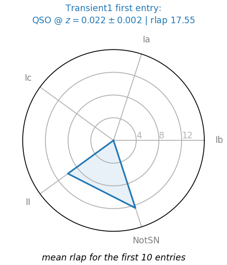
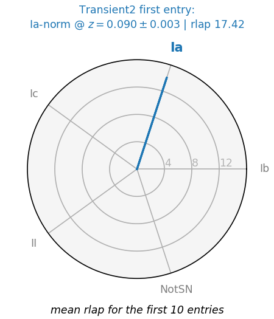

# typereader
Simple tool to read SN typing algorithms output  (e.g. SNID)

_the code should work on python 2.7 and 3.X (tested only on 3.6)_
## Installation
```bash
git clone https://github.com/MickaelRigault/typereader.git
cd typereader
python setup.py install
```


## Implemented Typing Tool:
 - SNID
 
## Usage
Each Typing method has its own Reader object. For instance SNID has a `SNIDReader` object. 

In that example, you can load `transientX_snid.output` (which is a typing file of the spectrum associated with the target `transientX` files as follows:
```python
import typereader
snid = typereader.load_snidreader("supernovablabla_snid.output", targetname="transientX")
```

To vizualize the output simply use:
```python
snid.show()
```
If will output something like this in the case on a unclear classification:



Or this for a clear "Ia" typing:


