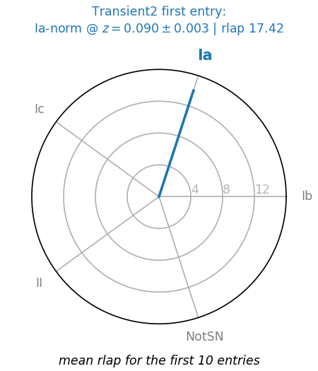

# typereader
Simple tool to read SN typing algorithms output  (e.g. SNID)

# Known Typing Methods:
 - SNID
 
# Usage
Each Typing method has its own Reader object. For instance SNID has a `SNIDReader` object. 

In that example, you can load `supernovablabla_snid.output` (which is a typing file of the spectrum associated with the target `supernovablabla` files as follows:
```python
import typereader
snid = typereader.load_snidreader("supernovablabla_snid.output", targetname="supernovablabla")
```

To vizualize the output simply use:
```python
snid.show()
```
If will output something like this in the case on a unclear classification:


Or this for a clear "Ia" typing:


